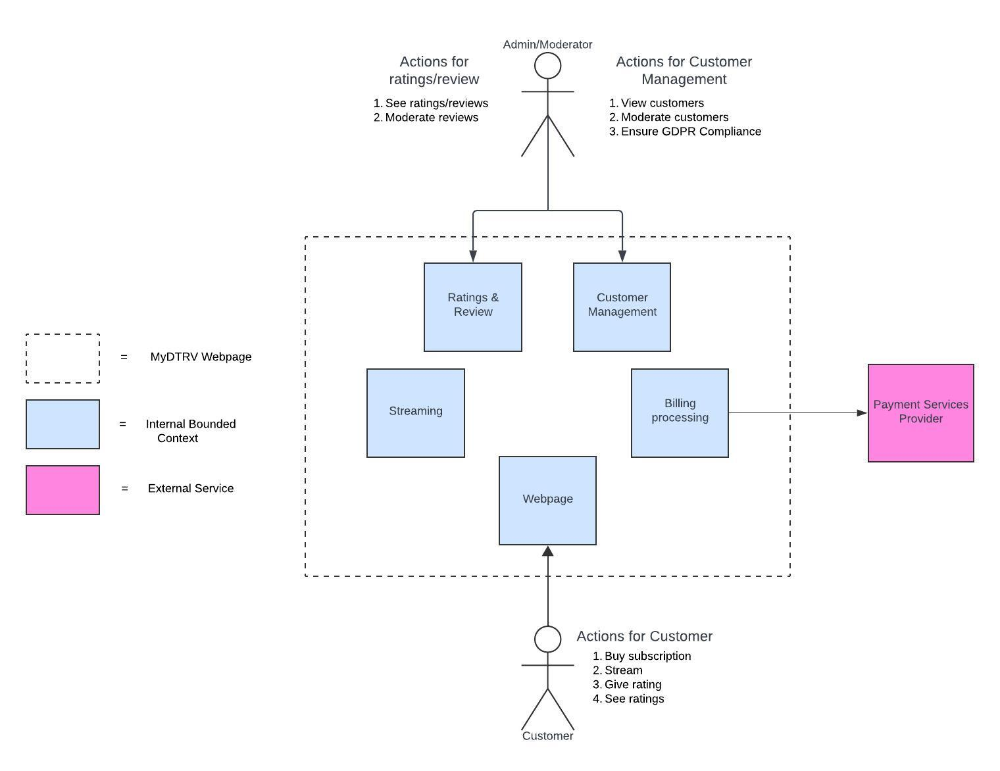
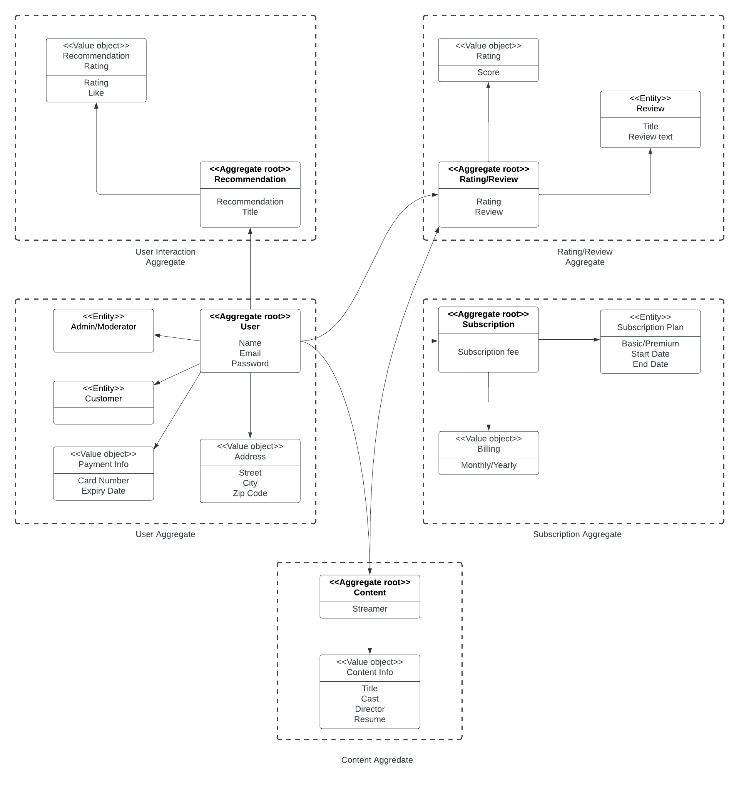

# DLS_OLA_A3
## Table of Contents
- [DLS\_OLA\_A3](#dls_ola_a3)
  - [Table of Contents](#table-of-contents)
  - [Choice of Architecture](#choice-of-architecture)
    - [Space-Based Architecture](#space-based-architecture)
    - [Layered Architecture](#layered-architecture)
    - [Event-Driven Architecture](#event-driven-architecture)
    - [Microkernel Architecture](#microkernel-architecture)
    - [Microservices Architecture](#microservices-architecture)
  - [Technology Stack](#technology-stack)
    - [Frontend](#frontend)
    - [Backend](#backend)
    - [Database](#database)
    - [DevOps](#devops)
    - [Hosting](#hosting)
  - [Domain Driven Design (DDD)](#domain-driven-design-ddd)
    - [Ratings and Reviews Context](#ratings-and-reviews-context)
    - [Customer Management Context](#customer-management-context)
    - [Streaming Context](#streaming-context)
    - [Billing Processing Context](#billing-processing-context)
    - [Web Page Context](#web-page-context)
  - [Aggregate Diagram:](#aggregate-diagram)

---

## Choice of Architecture
Til valget af arkitektur, er valget faldet på baggrund af den kravspecifikation vi har modtaget. Her er det især ting som “major collection of old tv programmes”, “high availability”, “rating system” som der bliver lagt vægt på. Ud fra hele kravspecifikationen og især disse 3 elementer har vi taget vores valg.

### Space-Based Architecture
Den første vi fravalgte var space based, selvom den umiddelbart virkede som en god mulighed. Eftersom vi er en streaming platform med et bruger-load som langt nemmere kan forudses, har vi ikke behovet for en arkitektur som har fokus på netop dette. Heller ikke store mængder data skal sendes frem og tilbage. Da en stor del af systemet skal bestå i at streame data til kunder, og ikke modtage noget fra dem udover ratings, så er der ikke brug for en mere kompleks måde at håndtere data på som eks en data-grid med space based.

### Layered Architecture
Layered architecture blev også fravalgt tidligt. Og det gjorde den af den simple grund, at vi har brug for “high availability”. Med en layered arkitektur ville vi ende op med et system som var modelleret som en monolit. Og selvom det kan give fordele ift. simplicitet og det nok også ville spare penge, både under udvikling men også når systemet skal gå i produktion, så ville vi løbe ind i problemer når det skal skaleres. 
Eftersom high availability er en vigtig del mener vi at der er brug for en distribueret arkitektur så hver service kan skaleres uafhængigt af de andre. Så hvis load på streamingdelen af systemet mod forventning skulle stige meget, eks. ved lanceringen af en ny sæson af en populær serie, så kan vi skalere den service så det kan følge med kundebehovet. Af den grund af layered architecture fravalgt.

### Event-Driven Architecture
Event driven kunne have været en mulighed for en potentiel arkitektur for dette system. Den gør brug af en distribueret arkitektur, og kan derved skaleres. Grunden til vi fravalgte denne er ikke fordi den ikke passer, men fordi at de fordele som kommer med ved en event driven arkitektur ikke er nogen vi har brug for.
En af de helt store aspekter er muligheden for asynkrone processer. 
Eftersom systemet primært skal kunne streame og dernæst have et robust ratingsystem, så er der ikke brug for den asynkrone del. Dernæst foretagere brugerne sig heller ikke mange events som skal kunne gøre ting, primært vil de fremsøge en serie/film og så se den, og eventuelt efterlade et review. 
Eftersom vi ikke ville bruge fordelene ved denne arkitektur, fravalgte vi den også.

### Microkernel Architecture
Ligesom event driven arkitektur blev microkernel også fravalgt på baggrund af at vi ikke har brug for de fordele som arkitekturen kan bidrage med. Eftersom systemet ikke på sigt skal have brug for “plug-ins”, så giver det ikke mening at bruge ekstra ressourcer på at udvikle systemet, ud fra den arkitektur. Hvis vi eksempelvis på sigt vidste at der skulle kunne introduceres nye subsystemer eller andre features som skal kunne tilføjes, så kunne det give mening. Men da det ikke er en del af kravspecifikationen, har vi fravalgt det.

### Microservices Architecture
Ud fra dette kan det virke som om at vores valg, som er microservices arkitekturen, kun er blevet valgt, fordi at vi har fravalgt de andre. Dette er også sandt, men det er også et bevidst tilvalg, da den rigtig godt passer til at løse denne opgave af flere årsager.
En simpel årsag er vores valg om at bruge domain driven design(DDD) til at udvikle systemet. Dette valg af design giver anledning til at bruge microservices, da partioneringen af systemet lægger op til en opdeling baseret på domænet.
Ved at gøre brug af den form for partionering sammen med DDD sikre vi kvaliteten af de forskellige services og gør det også nemmere for udviklerne af forstå hvad der skal udvikles ud fra opdelingen.

En anden årsag som i sidste ende er den vigtigste er at vi føler at den arkitektur giver os de bedste forudsætninger for at levere et system som opfylder krav specifikationerne. For kunden er det vigtigt at have “high availability”. Dette kan nemmere opnås med microservices da det er langt nemmere at skalere da man ikke behøver skalere hele systemet samtidigt men derimod kun der hvor det behøves. 
Derudover er systemet også tydeligt opdelt i hvad det skal kunne. Dette gør det også oplagt at bruge microservices, da vi med de forskellige microservices kan opdele funktionaliteten ud i de forskellige contexts, som vi udarbejder med DDD.

Så på baggrund af disse overvejelser vi har gjort os, mener vi at microservices arkitektur er den bedste arkitektur til at udvikle dette system.

---

## Technology Stack
Vores valg af teknologi er baseret både ud fra hvad vi som udviklere kender, men også hvad vi mener kunne fungere godt i et microservices miljø.

### Frontend
Til frontenden tænker vi at bruge React sammen med tailwind for at sætte en pænt og intuitivt side om ligner selv og kan genbruge components hele systemet rundt.
### Backend
Her har vi valgt at lave et rest api som skal udvikles i AspNet core.
### Database
Her har vi valgt en sql database, det kunne sagtens være mysql eller postgresql. Vi har valgt msql da den integregere godt med AspNet core frameworket.

### DevOps
Her tænker vi at hver microservice skal ligge i docker containere og styres med kubernetes. En ci/cd pipeline skal også opsættes med Github actions. Hertil skal der også bruges Sonarqube til at opretholde softwarekvalitet.

### Hosting
Vi har valgt at hoste systemet i Azure.

---

## Domain Driven Design (DDD)

### Ratings and Reviews Context
Bruges til at håndtere alle kunders interaktioner med de forskellige film og serier. En kunde kan blandt andet se og lave reviews over de film og serier, de har set. Som så vil kunne blive modereret og analyseret af henholdsvis en admin og systemet.

### Customer Management Context
Bruges til at håndtere kunder. Der skal være styr på, at opbevaringen af kundernes data overholder GDP-lovgivningen, og det er også her, der vil kunne modereres på en kunde-bruger.
### Streaming Context
Den store del af systemet. Denne del står for at have alle de film og serier som der skal ses. Det er vigtigt, at denne del er optimeret til at fungere på et globalt niveau.

### Billing Processing Context
Denne del står for at behandle betalingen af en subscription for en kunde. Den vil håndtere kundens betaling gennem et eksternt betalingssystem.

### Web Page Context
Dette vil være kundens vej ind til alt i systemet. Her vil der være en glidende og nem oplevelse for kunden. Hvor det skal være nemt at oprette sig, og man hurtigt kan komme ind og se og anmelde alle de film og serier, som produktet tilbyder.
 

---

## Aggregate Diagram:
Vi har også lavet diagram over eventuelle aggregater der kunne være i systemet. Dette kan bruges til at se, hvilke domæner og delsystemer der kunne spille sammen i en samlet løsning. 
Et eksempel på en af de aggregates, som vi har medtaget, er User Aggregate. I denne er User vores aggregate root, der holder på flere andre objekter. Brugeren har grundlæggende attributter som navn, email og password. User er aggregate root, fordi den samler de vigtigste attributter og forretningslogik omkring en users identitet.
Admin/Moderator og Customer (Entities) er roller, hvor det er meningen, at de skal kunne modelleres efter de tilladelser/behov de hver især har, hvilket tillader udvidelse af user-roller.
Address og Payment Info er værdier (Value Objects), som ikke har deres egen identitet men er knyttet til en bruger. Value Objects er immutable, hvilket betyder, at hvis der sker en ændring, bliver der skabt en ny instans, frem for at den eksisterende ændres. Dette giver konsistens programmet.
Adskillelsen af Value Objects som Payment Info og Address er fornuftig, da disse data ikke har deres egen identitet og bruges direkte i brugerkonteksten.
Denne Aggregate Root har i dette tilfælde forbindelse til alle de andre Aggregate Roots. En af forbindelserne, eksempelvis Content, har en User adgang til, da de skal kunne tilgå deres “produkt”, i dette tilfælde streamingtjenestens indhold.
